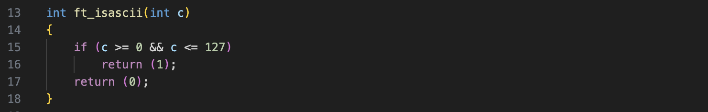

<!-- Format:  -->

# Libft - The first project at Codam 
This is a custom C library, which includes several standard C functions for string manipulation, memory allocation and linked list handling, which enables essential C utilities.

These functions are then linked and packaged into a static library called *libft.a*. The library can be linked to other projects to easily make use of these functions.

---
### Key Concepts:
- Character manipulation functions (isalpha, isdigit, tolower, etc.)
- Algorithms and data structures
- String handling functions (strlen, strcpy, strcat, etc.)
- Memory management functions (malloc, free, memset, etc.)
- Additional utility functions for various common tasks (ft_split, str_trim, itoa, etc)
- Linked list operations for dynamic data structures
- Makefile construction
---
